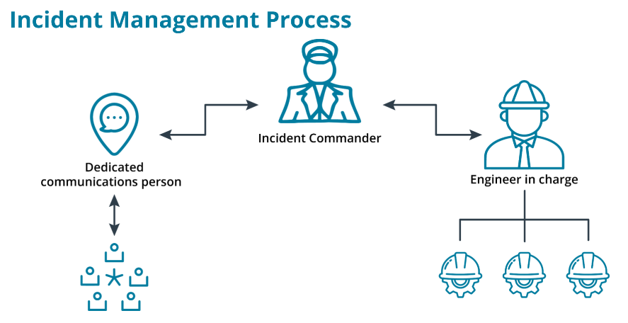
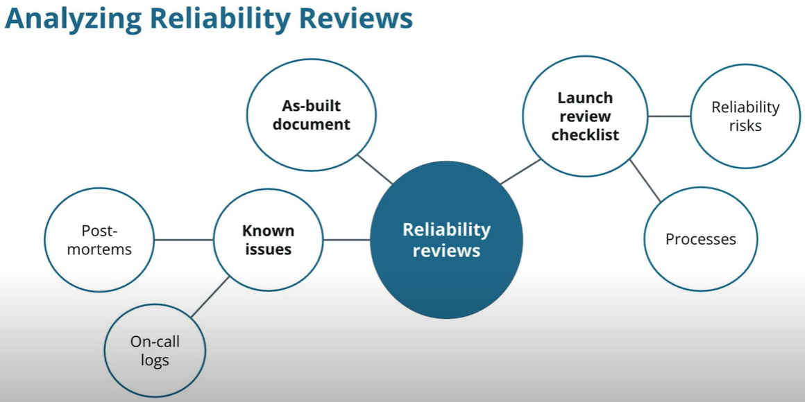

# Improving On-call Effectiveness

## Introduction to Improving On-call Effectiveness

**On-Call:** The period of time when you are responsible for responding to issues. Most teams use some sort of “paging” service to alert the on-call engineer to an issue.

### Effective On-Calls

* Balanced between operational work and on-call work
* Have clear documentation for
    * Escalation
    * Incident management process
* A continuous process
    * Regularly review the quality of on-call life
    * Establish metrics for tracking goals

### Thoughts from an Expert

* Balanced on-call rotations
* Prepare for a messy start
* Prevent complacency
* Solid foundation of documentation is key
* Healthy culture is everything

## Incident Management

### When is an Incident?

To identify an incident, you should review the following metrics:

* **SLO/SLAs you have with customers (both internal and external)**
    * SLO/SLAs define your obligations to customers and the metrics for meeting those obligations.
    * Your team should be involved with creating the SLA/SLOs.
* **Actions necessary to correct an issue**
    * if an engineer has to make major changes to the system, it is most likely an incident. A major change includes things like reboots, rollbacks, configuration changes.
    * These major changes or actions need to be coordinated between different groups.
* **Time spent on correcting the issue**
    * Set a threshold for the max time for which an engineer can troubleshoot an issue before calling for backup.
    * Setting this threshold prevents issues from dragging on or becoming full-blown outages and promotes better on-call balance.
* **Data issues**
    * If there are any issues with data, it should immediately be declared an incident. You should ensure your customers' data is intact and secure.
    * Data issues include loss, corruption, and non-compliance.
        * Data loss: if data does not reach its destination, is not saved to disk, or is deleted by accident.
        * Data non-compliance: examples are data theft or inappropriate access.
* **Visibility**
    * If any external customer can see the effects of an issue, it is an Incident. For example, if customers would notice that a system is down, then it is an incident.

### Incident Management Process

* Incident commander
    * Notify the incident commander as soon as an incident is declared.
    * The incident commander's responsibilities include:
        * In charge of coordinating tasks and delegating duties.
        * Engage additional resources as necessary.
        * Initiate a central point of communication, i.e., a shared state document.
* Communications
    * There should also be a person dedicated to handling communications.
        * Is in charge of tracking the state of the incident.
        * Updates relevant stakeholders on the state of the incident.
* Engineers
    * The group performing operational work.
        * Should be the only group doing operation work.
    * Should have one engineer-in-charge coordinating work.

### Benefits of Having a Clear Command Structure

* Keep everyone calm and focused
* Weel-thought-out actions better than snap decisions
* Easier to bring in additional resources

### Documenting an Incident

* Important Incident Documents
    * Live state document during incident
        * Provide the state of the incident
        * Reference for writing a post-mortem
    * Post-mortem

### Structure of a Live State Document

* Stakeholders
    * Everyone involved and those affected
        * Operations, communications, management, and the Incident Commander
    * Internal and external consumers
* Timeline
    * Actions
    * Communications
    * Alerts
    * Track things as they come in
    * Central location of events for cause-effect construction
* Summary
    * High-level summary for non-technical people
        * Update the executive management
        * Customer communications
    * Additional operational support: Good overview of the situation
* Technical Status Report
    * More technical and detailed status report
        * Get support team(s) up-to-speed
        * Centralize the state of affected systems
    * Review this section periodically
* Resolution Objectives
    * Align with your SLA or other metrics
    * Measurable objective with clear goal
    * Incident resolved
* Post-Incident Actions
    * Future steps for incident prevention
    * Basis for action plan in post-mortem
    * General fixes that should be implemented

## On-Call Best Practices

### Balanced On-Call Shifts

* Balancing time spent on-call
* Higher stress leads to lower performance, high burnout and turnover
* Balance on-call with operational work
* Operational work accomplishes longer-term reliability objectives

### Documenting On-Call Events: Alerts and Pages

* Document alers and pages during on-call shift
* Quantify the quality of on-call shifts
* Review frequency and types of alerts/pages for underlying issues
* Hand over on-call duties to the team that developed it

### Documenting On-Call Events: Alert Resolution

* Track alert resolution
    * Starting point for future troubleshooting
    * Automation opportunities
* Create an **on-call log** with summaries of all the events
    * Date & time
    * Summary
    * Resolution
    * Store in a central and accessible place; review regularly
    * Make logs searchable

### Correcting Unbalanced On-Calls

* Regularly review on-call logs to look for trouble spots
    * Look at monitoring and alert thresholds
    * Consider underlying issues
    * Pass off on-call duties to maintainers
    * Set a reasonable goal for taking back alerts
* Dedicated SRE to improve best practices

### On-Call Best Practices

* Document processes in your on-call
* On-call procedure should be well-defined, documented, and accessible
* Establish a clear path for handling alerts
* Escalation procedures define
    * When escalation is required and who to escalate to
    * What happens if a page is not respond
    * Secondary on-call person
* Incident management procedure for on-call engineer's reference
    * Keep everyone in sync
    * Reduce anxiety and empower on-call engineer
* What happens after an incident
    * Discuss and solve root cause blamelessy

## Post-Mortem Best Practices

### What is a "Blameless" Culture?

* How we react after an incident
* Establish root cause and future prevention
* Enforce accountability over blame
* No good to assign blame
* Focus on the why, not the who

### Post-Mortem: What and When?

**Post-Mortem = Root Cause Analysis**

* Determine the cause of the issue
    * Discuss the cause and dig deeper
* Describe the incident with an action plan
    * A clear plan to address the root cause

### Documenting a Post-Mortem

* Similar to the live state document kept during incident
* Goal if different:
    * Live state document: Keep a log of current state
    * Post-mortem: Impact and resulting action plan

### Structure of a Post-Mortem

1. Stakeholders
2. Timeline
3. Impact Assessment
4. Resolution
    * What actions were necessary and why
5. Action Plan

### Review Post-Mortems

* Practice makes perfect
* Double-check remediation
* Process review

## Analyzing-reliability-risks

### Known issues

* Find patterns to alerts/issues
* Dig down to root causes
* Example: Suppressing alerts
* Ensure known issues are handled/remediated

### As-built Document

* Compare current risks to those in the post-mortem
* Look for the same signs of reliability

### Launch Reviews

* Make sure checklist is complete
* Compare as-built to launch review to track changes
* Update your launch review checklist to include any missed sections