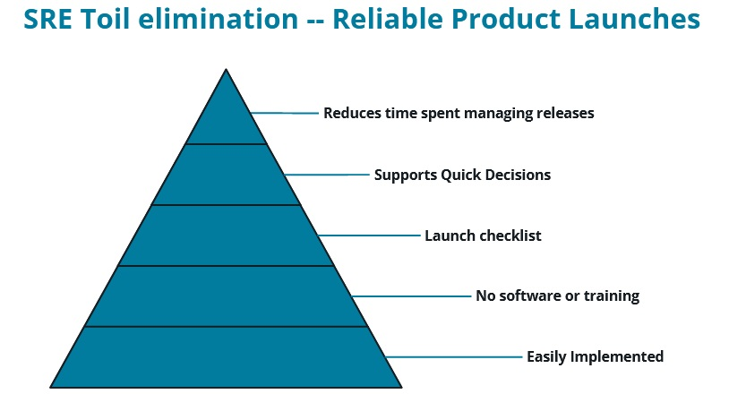

# Improving Enterprise Workflows with SRE Best Practices

## SRE Best Practices

### On-call & Incident Response

On-call & incident response strategies:

* Primary/secondary contacts are on-call one week a month. With a secondary contact, if you happen to be away from the phone, the call will divert to that person.

* The on-call contact only handles essential events.

* Instituting a "follow the sun" model to eliminate night shifts.

* Limit the number of incident responses to two per shift.

* Have playbooks (see the example below) that are comprised of escalation paths and incident-management procedures.

#### Playbooks

* Location to important files.
* Remedy an incident.
* Tied to an alert.
* Easily understood.

#### Playbooks -- Example

---------------------------------------------------------

Tied to alert [ALERT_NAME]

**Summary:**

The application and webservice intermittently fail to connect to the database and needs restarted. Check the logs for connection failures and restart the application.

**Summary of architecture"**

There is a web application [NAME] and a webservice [NAME] which connect to a SQL Database [NAME and LOCATION OF SQL DATABASE]

* Log Locations
    * Error log
        * /var/log/myapp/myapp-error.log
        * /var/log/myapp-service/myapp-service.log
    * Application log
        * /var/log/myapp/myapp.log

**Remediation Steps**

Login to [SERVER_NAME] and run the myapp-restart.sh script. Once myapp restarts, run the myapp-service.sh script. The connection to the database should be restored. Verify successful connections in the log files.

---------------------------------------------------------

### Post-Mortems

#### Items to include in a post-mortem:

* A record of an incident and its impact.
* Actions taken to mitigate the incident.
* The incident root cause.
* Any prevention measures.
* Identification of the causes of system failure, not pointing fingers.

#### Instituting a blameless post-mortem culture:

* The problem and system failure.
* Involving everyone on the team.
* Collecting thoughts and solutions from smart people.
* Finding a permanent solution.

#### Postmortem Document

* High-level Summary
    * Impact
    * Root Cause
* Technical Summary
    * Mitigation Steps
    * Prevention Measures
* Summary/Notes
    * Additional data

### Reliable Product Releases

**Reliable product releases include:**

* Architecture and dependencies
    * Latency requirements
    * Request flow from front-end to back-end
    * The volume of requests
* Integration consists of:
    * DNS
    * Load balancing
    * Monitoring
* Failure Modes are:
    * Single-points of failure
    * Mitigation tactics of failure within the system
* Process and Automation highlights:
    * Any manual process
    * Documentation
* Rollout Planning involves:
    * How the change goes live
    * Canary deployments

#### Reliable Product Releases - Launch Checklist Example

---------------------------------------------------------

**Architecture/Volume**

Provide an architecture diagram of request/response flow.

Attach the loat test results.

**Integration**

*DNS names(s) created*

* [DNS Name 1]

*LoadBalancer rules*

* [LoadBalancer identifier] - [Rule 1]

*Monitoring configuration has been provided*

* [Install monitoring agent on VM]

**Single-points of failure**

* [There is only one API that talks to the database]

**Manual processes documented**

* [Init script needs run before app is installed]

---------------------------------------------------------

## Enterprise Workflows

Toil is defined as:

**Toil** -- any task that takes a reaction and interrupts a human.

**Overhead** -- completing a number of sub-tasks prior to running the actual task.

**Manual Intervention** -- if the computer can complete the task just as well or better than a human, then the human ought to step aside and let the computer do its job.

**Repetitive Tasks** -- things that need human intervention over and over again, either on a regular schedule (like running a monthly report) or reacting to a server constantly having a disk full of log files.

## Eliminating toil in any organization

### Using reliable product launches provides the following advantages:

* Easily implemented
* No software or training
* Launch checklist
* Supports quick decisions
* Reduces time spent managing releases

### Monitoring

* Provides visibility into the system & an alerting mechanism
* Dashboard of “the golden 4”
* Provide the team ways to decide how to fix problems associated with the golden 4
    * Examples include:
        * Using load balancers
        * Adding servers when demand is high
        * Automated traffic routing
        * Fixing errors in the application

### Overall benefits:

* No consultants
* No expensive software packages
    * Some of the most popular monitoring tools are free
* Focus on processes
    * Use a release checklist and monitoring system

## Cost-benefit Analysis and SRE Impact

SRE Costs:

**Redundancy** or adding more IT infrastructure in different geographies.

Provides capabilities such as:

* Taking a server offline to perform maintenance
* Implement zero-downtime deployments
* Routing traffic away from a problem server during an incident

**Opportunity Costs**

* Improving the system means not building revenue-generating features
* Slows the release of new features
* Regular operations work keeps SRE teams from engineering