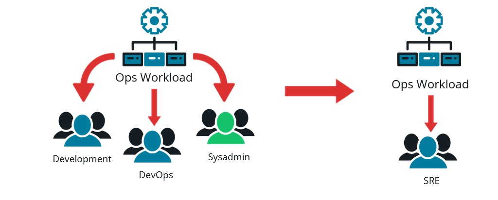
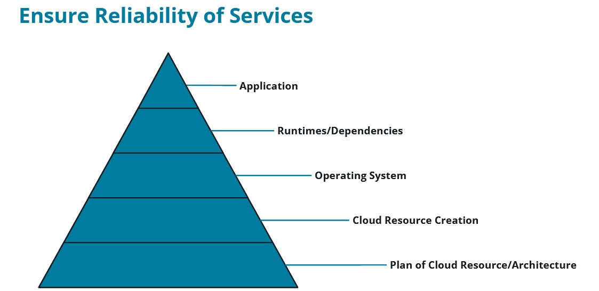

# SRE Roles and Responsibilities in Enterprise

## Shifting the Ops Workload to a New SRE Team

## Development vs Operations

* Goal of Development: releases.
* Goal of Operations: stability.
* Tension: Every release risks stability.
* Group of developers support their applications.

## SRE Scope of Work

### SRE's responsibilities include:

* Incident Response -- responding to incidents in production environments.
* Post-mortems -- root cause analysis, preventing the issue in the future.
* Monitoring & Alering -- creating and using dashboards and alerting mechanisms.
* Capacity Planning -- planning new infrastructure to accommodate application demands.

### DevOps responsibilities include:

* Efficient Software Delivery -- the correct version of the software is in the proper environment.
* Release Automation -- no human needed to release software.
* Configuration Management -- configuring environments to support a software application.
* Infrastructure as Code -- storing environment configurations in source control.

### SysAdmins responsibilities include:

* Access Control -- creating user accounts and assigning permission to those.
* User Training -- showing users how to use the software needed to complete daily job tasks.
* Backup/Restore of data -- ensuring data is backed up and can be restored should a disster happen.
* Automate routine tasks -- one example is purging old emails.
* Documentation -- this includes system configuration, backup/restore process, and user roles/access.

### Developers responsibilities include:

* Meeting client requirements -- coding these requirements in the development phase of the SDLS.
* Creating unit tests -- quick tests to ensure their logic is behaving the way it should be.
* System requirements -- analyze and provide system requirements to run their application.
* Documentation -- most of the documentation they provide are comments within code.

## Core Skills of SRE

The core skills of SRE are:

* Monitoring -- creating dashboards to display the status of the system
* Information Gathering -- compiling pertinent information like log files and software versions and sharing with the SRE and development teams
* The "Golden 4" -- latency, saturation, errors, traffic (see new terms below)
* Updating The System -- planning and coordinating system upgrades, security updates, or regular patches
* Release Coordination -- gather everything needed for the release of the next version of the application
* Creating Infrastructure -- providing an environment for the system to operate

### The Golden 4

* latency - the time it takes to send a request and obtain a response
* saturation - a measure of the amount of traffic
* errors - failed requests
* traffic - how many requests are happening