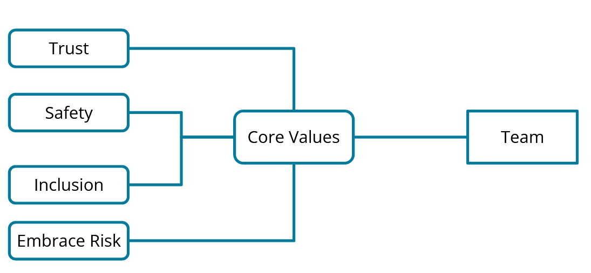

# SRE Teams

## Measuring tension between Development & SRE

* Software Fault Tolerance
    * Code structure -- using modular blocks of code makes it easier to debug and fix errors.
    * Exception handling -- programming for “what if”
    * Retry logic -- e.g., if a connection is lost, the program retries until successful.
* Software Testing
    * Unit testing -- basic levels of testing which evaluate code logic
    * Integration testing-- testing software modules as a group
    * System testing -- testing the entire software system
* Frequency of Deployments
    * More deployments = more feedback on code
    * Enables the team to deliver value to stakeholders more quickly
    * Incorporate testing to provide quality code

## Development Strategies for Mitigating Risk

**Feature flags** are code blocks that can be toggled on or off for a subset of users. The idea is to have a select group of users test the new feature, then roll it out to a wider audience in a later release.

**Releasing more minor changes more frequently:** changes may only be a few lines of code or a small function of the application. If an incident were to occur, it's easy to diagnose and fix.

**Isolating changes:** changes may only affect the database or the UI of the website, for example. If an incident were to occur, it's easy to diagnose and fix. Rolling back the change would only affect one component.

## Defining SRE Roles and Responsibilities

**Team Lead:**

* Directs the work
* Keeps team focused
* Contributes to architecture meetings
* Forms workflows of the team

**System Architect:**

* Create scalable infrastructure
* Document/Diagram infrastructure
* Make recommendations for new technologies
* Provide migration paths to new technology
* This role would use IaC (Infrastructure as Code) tools to provision infrastructure and diagramming tools

**Infrastructure Engineer:**

* 50% development tasks, 50% operations tasks
* Can use their time to automate Ops tasks
* Planning/executing system patches/updates
* This role would use different scripting languages to automate tasks, as well as configuration management tools like Ansible

**Release Manager:**

* Change management
* Code releases
* Ensures code has all dependencies satisfied
* Executes the release, and rollback procedures
* This role would use a CI/CD tool along with the source control tool to ensure the code could be released or rolled back, as well as verify the correct changes

**Monitoring Engineer:**

* Creating dashboards
* Managing alerting rules
* Usually first to know of an incident
* Manages monitoring rules/governance for new/existing IT infrastructure
* This role would use monitoring software such as Prometheus/Grafana or be most interested in the dashboarding/alerting features of other types of monitoring software

## SRE Team Mission

The benefits of a team mission/vision include:

* Shared approach
* Strategy
* Direction to solving a problem
* Providing benefits more significant than the team itself
* Higher work satisfaction
* Less conflict

Governance of Teams - Core Values

* **Error Budgets** - Is the maximum amount of time a technical system can fail without contractual consequences
* **Opportunities** - Elements in the environment that the team could exploit to its advantage as included in part of a SWOT analysis.
* **Strengths** - Characteristics of the team that give it an advantage over other teams as included in part of a SWOT analysis.
* **Threats** - Factors in the environment that could cause trouble for the team as included in part of a SWOT analysis.
* **Weaknesses** - Characteristics of the team that give it a disadvantage to others as included in part of a SWOT analysis.

