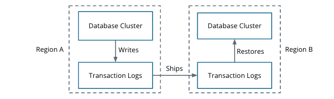
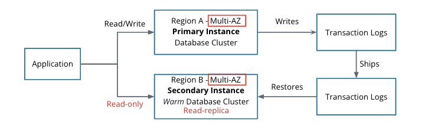
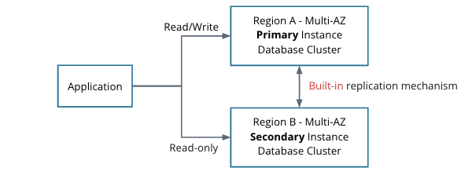

# High Availability and DR of Databases

## RTO and RPO

* **R**ecovery **T**ime **O**bjective
    * How long till we can recover given a failure
    * Example: database will be back online in 15 minutes following a failure
* **R**ecovery **P**oint **O**bjective
    * How much data can we lose
    * Example: database will take backups every 15 minutes

## Explore SQL Log Shipping

* Recovery and replication mechanism for database management systems
* Transaction: a completed query request
    * E.g. adding an entry to a database
* Transaction logs: log all transactions to files
* Logs grow quickly and are rotated through quickly

* Log shipping can be used for database recovery
* The transaction logs live in each database cluster
* Primary cluster writes to its transaction log and ships those logs to the secondary transaction log storage to restores the secondary database

* The database will be unavailable for reads or writes during the restore operation
* The secondary instance can be used as a read-only copy
* Best practice: nodes of the database cluster are in separate availability zones

### Database Cluster Monitor

* Alert when the secondary region goes offline
* Alert when the secondary does not apply logs properly
* Alert when the primary does not ship logs properly
* Prevents the cluster from "self-checking"
* Some can be used as a voting system

### Properties of Log Shipping Recovery

Pros:

* Easy to setup
    * Generally, no advanced setup and the secondary instance is easy to set up in another region
* Low cost
    * Generally, no additional software is required
    * Generally, no additional hardware is required
    * Low admin overhead

Cons:

* Manual failover
    * Log shipping requires a manual failover to the secondary cluster
    * May need to re-configure applications to point to the new primary cluster
* Slow recovery
    * Time required to fully apply the backup
* Slow fail-back
    * Must re-configure log shipping and perform a full restore to failback
    
## Geo-Replication for SQL Instances

* Continuous data synchronization between regions
* The secondary database can take over during a failure within seconds
* Automatic failover!
* Can flip the primary and secondary back
    * A unique feature of geo-replication
    * No technical requirements to run a primary in a particular zone

**Pros**

* Fast recovery
    * No lag between the primary and secondary database clusters
* Automatic failover
    * The secondary can automatically promote itself
    * The application can point to a DNS entry that can automatically flip
* Seamless recovery

**Cons**

* Costly
    * Requires additional software licensing and hardware
* Setup is complex
    * Requires additional software knowledge
    * Requires additional monitoring
