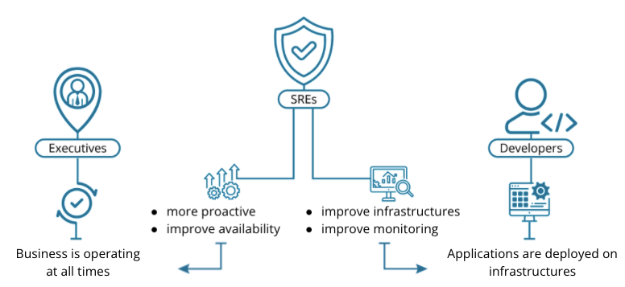

# Introduction

## Introduction to Planning for High Availability and Incident Response

* **High Availability (HA):** this referec to ensuring the resource is robust and can withstand failures and still be accessible to users.
* **Service level objective (SLO):** this is the objective a business sets for application availability or performace.
* **Service level indicator (SLI):** this is the indicator that makes up the objectives. You use SLIs to craft you objectives.
* **Disaster recovery (DR):** a plan or procedure to restore service in the event of a failure or disaster.
* **Infrastructure as code (IaC):** a method for defining and deploying infrastructure through declarative code.

## Business Stakeholders

**Business executives** - their goal is to have the business operating and making money at all times. They want the highest uptime. They benefit from the proactive nature of SREs and also the improved availability.

**Developers** - their goal is to have available and consistent infrastructure fast! They benefit from the monitoring and automation brought by SREs.

## When to Use High Availability and Incident Response

* **High uptime**
* **Complex infrastructure**
* **Ease of management**
* **DR transition**

## When Not to Use High Availability and Incident Response

* **Costs**
* **Learning curve**
* **Software limitations**