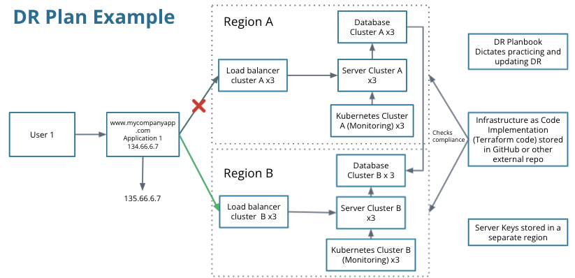

# IT Assets, Availability and Disaster Recovery

**Disaster Recovery = Business Continuity = Prevent lost Revenue!**

* **Disaster:** anything that disrupts the normal flow of business
* **The goal for businesses:** minimize downtime

## Discovering IT Assests

### Assets

* Existing documentation
    * CMDB (Configuration management database)
    * Service catalog
    * Diagrams
* Breaking Down Infrastructure
    * Expand existing documents and fill in the missing pieces
    * Servers, storage arrays, load balancers, switches...
    * Databases
    * Even the small pieces matter! (Ex. SSH key)

### Business Critical Applications

* Any application that serves a critical function of the business
* How can you identify these critical applications?
    * Conduct a survey or job shadow different business units
        * Ask: does it make the business money?
        * Ask: if it goes down, what functions stop?
        * Ask: who or what units are impacted when it goes down?

## Consolidating IT Assets

### Why Consolidate?

* Cloud-centric
    * Many cloud resources are serverles or not-managetd
    * Cloud provider is consolidating resources on the backend
* Cost effective
    * Less cost, less underlying hardware, less software licensing and less manpower
    * With could: billed per hour or per transaction or per how may instances you are running
* Simpler management
    * Less work
    * Less dependencies and less failures
    * High complexity means higher skill sets of the admins, more ares for failure, more infrastructure to document
* Better availability
    * Cloud providers have HA built in to many servers
    * Move a single app running on a single server to a group of servers

### What to Consolidate?

* Similar departments
* Similar functions

### Example

* Current setup
    * 3 web servers running an HR application
    * 3 database servers serving the HR application
    * 3 web server serving the recruiting system
    * 3 database servers serving recruiting system
* Consolidated setup
    * 3 web servers running HR application
    * 3 database servers serving the HR application

### Cons of Consolidation

* You may not always know why the separation is there
* Resources dictate separation
* More risks: if one server fails, potentially more applications fail

## Making Infrastructure Highly Available

### High availability

* Robust - resistant to many failuers
* 2 is better than 1
* Helps with maintenance
* Failover - using an alternate instance of the application than what you were previously using
    * flip the switch and start using the other instance of an application
    * flip the switch and using your alternate location for disaster recovery purposes

### HA Best Practices

* **Voting system**
    * Odd numbers instead of even
* **Availability zones**
    * Different physical locations in close proximity, typically 40-50 miles
* **Regions**
    * Different geographic locations for resources separated by hundreds of miles

## Creating a DR Plan

### Disaster Recovery Principals

* Ensure infrastructure is deployed in another location
    * Configuration drift - any changes done at the primary site are not done at the DR site
    * Automation can help prevent configuration drift
    * If automation isn't an option, set up policy in the DR plan to continually check the DR site
* Must be practiced
    * Actually flowing some production traffic through DR is critical to ensure the infrastructure actually works
    * Practicing annually or quarterly helps ensure the steps are still accurate and work as intended
* Updated DR Plan often
    * Remember that technology is always changing and the DR plan should change with it
    * E.g. add server nodes to accommodate load - should be documented in the DR plan
    * E.g. retire an application - should be removed from the DR plan

### Disaster Recovery Strategies

* DNS - domain name system
    * Users don't have to memorize IPs and can use friendly names
    * DNS allows you to "hide" a specific IP of data center or sesrver to make failover more seamless
* Database replication
    * Ensures your database is exactly the same in both locations
    * Automatic and seamless failover with database replication, making sure the database can come back online quickly with little to no changes

### Basic DR Plan

* Pre-Steps
    * Ensure both sites are configured the same
    * You can use infrastructure as code (IaC) to do this
* Steps:
    * Point your DNS to your secondary region
        * This can be done with a name provider like Amazon route 53
    * Failover your database replication instances to another region
        * Manually force the secondary region to become primary at the database level
        * Automatically failover the database by health checks

