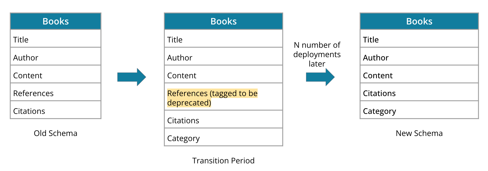
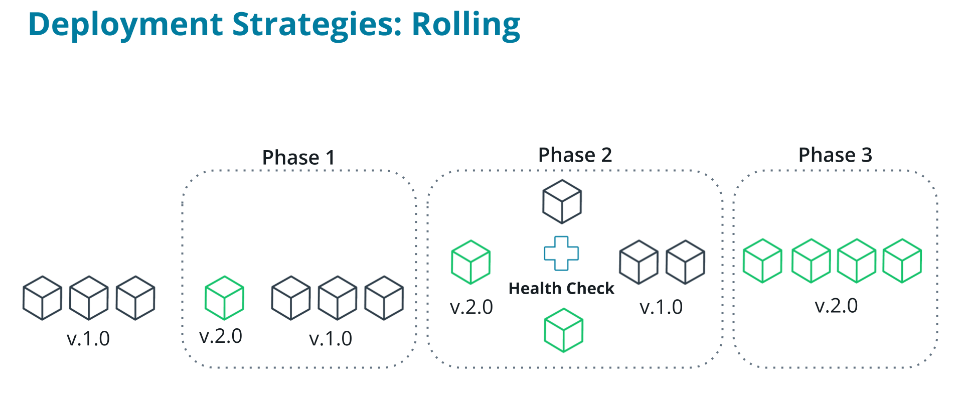
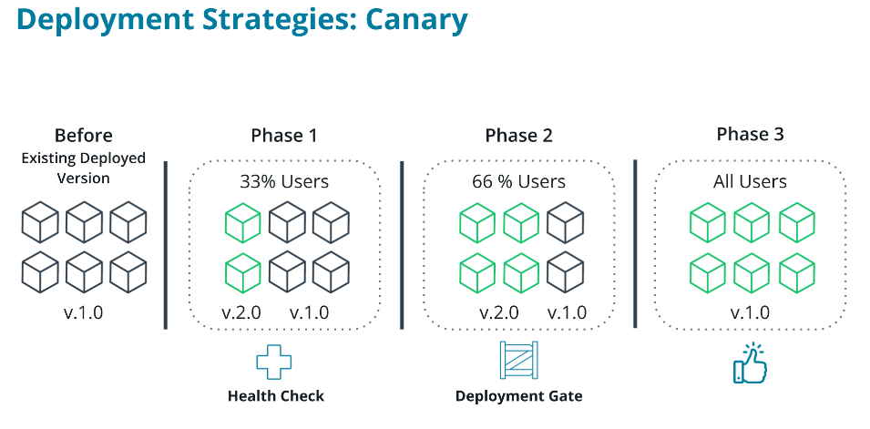
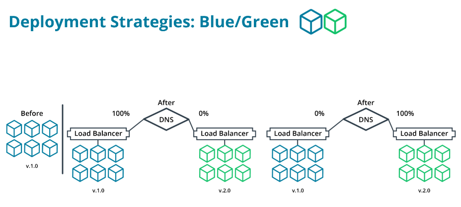

# Self-healing Deployment Strategies

## Deployment Strategies: Basic

Active services are brought down together and replaced with the new version

**Pros**
* Simple
* Fast
* Cheap

**Cons**
* High Risk
* Destructive, causes outages
* Not a best practice
* Not easy to rollback

**Usage scenarios:**
* Application is non-critical to the business or mission
* Deploying to a lower environment
* Application is not in use
* During off-hours

## Rolling Back Deployments

### Rollback Deployment Scenarios

* Errors on deployment completion
* Broken functionality during deployment testing
* Rejected version

### Complications with Rollbacks & Databases

**Rollbacks that include databases must be critically assessed:**

* Deleted table rows
* Populated new tables
* Roll forward with backward compatible database changes

Rolling forward with backward compatible database changes is possible following the **Expand/Contract** method

## Rolling Deployments

### Deployment Strategies: Rolling

* Active services are brought down incrementally
* Services replaced with new versions after passing a health check

**Health check:** a periodic REST API call to confirm the status of your microservice

**Pros:**

* Simple to rollback*
* Not as destructive
* Zero downtime
* Cheap

**Cons:**
* Requires support for multiple deployed versions
* Health check verification may be slow

**Usage scenarios**

* Works best in environment where applications are independent of each other. For e.g. microservices
* Useful when rolling out small changes to an application

## Canary Deployments

### Canary Deployments Pros and Cons

* **Canary Deployment:** Deploying the new version of an application incrementally to a subset of users.
* **Deployment Gate:** manually triggering the next phase of a deployment.

**Pros**

* Low Risk
* Beta test new features with real users
* Configurable deployment speed
* Cheaper than Blue-green
* Easy to rollback*

**Cons**

* Multiple active versions
* Feature Flags in application code
* Testing with real users
* Complex deployment automation
* Manual verification

## Deployment Strategies: Blue/Green

* Duplicate environments
* Load balance between environments

**Pros:**

* Safest way to deploy an application
* Zero downtime
* Route subset of users to new version
* Safe environment to smoke test

**Cons:**

* Expensive
* Complex database schema changes
* Complex deployment scripts

**Usage scenarios:**

* When you have a monolithic application that takes a long time to deploy
* when you want full control over which users have access to the new version
